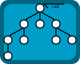

# Node Structures

All nodes have an enter point called parent, wich is the source of who started the connection, and an exit point called children, wich is the target the node has been connected to.

The connection with multple nodes is called connection group and each of them can be connected directly, as a child or parent, and indirectly, as a child of a child or a parent of a parent.

This list show multiple types of structures implemented inside the collection.

## Tree Structure

Objects are arranged as an hierarchy, a node has 1 parent and multiple childrens, a child can be connected with only a single parent but it can expand into multiple childrens.

The whole connection group start from an initial point but an end cannot be determinate because each node may have a different end point.

The initial point is called root and it does not have a parent.

- since: 1.0

## Chain Structure

Objects are arranged as a linear path, a node has 1 parent and 1 child.

The whole connection group start from an initial point to an end point.

The initial point is called start and the final is called end.

- since: 1.0

# Relation Structure

Objects are arranged into a mess of connections, a node has multiple parents and childrens.

The whole connection group cannot determinate a start or end point inside this structure.

- since: 1.0
